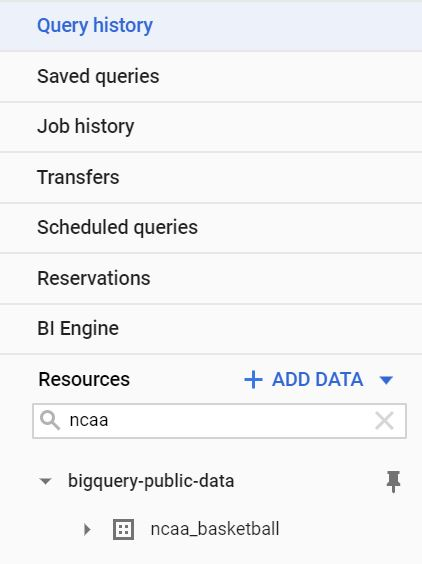
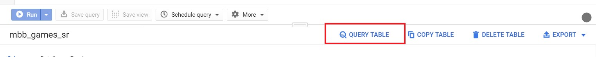
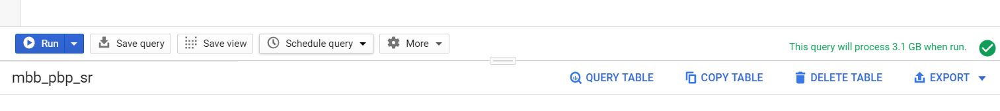

# Programming Homework 1: SQL 

Gain a hands-on understanding of Google BigQuery and SQL.

Due: __Feb 27, 2020, 11:59 AM__ (1 minute before noon!)

## Overview

Welcome to COMS4121! This assignment will help you get familiar with the Google BigQuery platform and the SQL language.
Google has published many datasets on BigQuery -- these range from StackOverflow statistics to real-time air quality data. In this first assignment, you will be using BigQuery’s SQL interface to answer questions about the NCAA Basketball Dataset. 

## Learning Outcomes

After completing this programming assignment, students should be able to:

* Write SQL queries on the Google BigQuery platform.

## Getting Started

This section will guide you through creating a BigQuery project and setting up your account so that you can query the NCAA dataset.


1. Make sure you have followed the [instructions](http://www.cs.columbia.edu/crf/cloud-cs/) provided by CRF to redeem your credits in Google Cloud.

2. Click this [link](https://console.cloud.google.com/projectselector2/home/dashboard?_ga=2.206924560.-2028360840.1569012083). You’ll see the page below; click “Create” to make a GCP (Google Cloud Platform) project.

3. Fill in the information to make a new project. Make sure to select the new billing account you should have after getting the class credits.

   

4. Go to this [link](https://console.cloud.google.com/bigquery?project=bigquery-public-data&page=project), which is the page for BigQuery’s public datasets. In the top-right corner of the bottom panel, click the `PIN PROJECT`. 

   Now when you visit the console, you’ll be able to easily find the datasets in your sidebar. Type ncaa in the search bar and you should find the dataset `ncaa_basketball`

   

   

   

5. Click on the dataset, and you should see 10 tables in the dataset. Click on each table, and you should see the schema and descriptions of each table. 

   It is recommended to get yourself familiar with these tables before you jump into writing queries. We intend for this assignment to be about how to translate a question in plain English to a schema - in other words, we want you to read the tables and explore the data and think about which tables and columns are necessary in answering the question we’re asking. This is how real world data querying and analysis works!

6. Click on `QUERY TABLE` on the bottom panel to start a query on a table. 

7. Once you typed in your query, you should notice there is a green validator on the bottom right corner of the top panel. It will give you an estimation of how much data will be processed to run this query. **Note:** you will be billed by the number of bytes read by each query, and each month only the __first 1TB is free__, so be careful and try to avoid using **SELECT \*** 

   

8. In declarative languages, it’s easier to build up the query piece by piece. Start with a basic frame of what you’re looking for (maybe write the conditions, or do a join). Then add complexity to your query one bit at a time. It’s much easier to debug this way as well.

9. BigQuery can auto-format your SQL queries with `CTRL-SHIFT-F` on Windows or `CMD-SHIFT-F` on Mac (You might need to do some editing for it to take effect). This might be nice to learn about conventional SQL style guidelines (and will also make your queries more readable, which we appreciate).

   __Note__: When querying in BigQuery, table names should be wrapped in backticks (`). For example, instead of saying:

   ```sql
   SELECT * FROM bigquery-public-data.ncaa_basketball.mascots
   ```

   say:

   ```sql
   SELECT * FROM `bigquery-public-data.ncaa_basketball.mascots`
   ```

   

## Questions

Now that you’ve gotten comfortable and familiar with BigQuery and its SQL querying interface, let’s get to work and answer some questions about the NCAA Basketball dataset!

You will be asked to submit a CSV file for each question, and you could download the results of a query using the `SAVE RESULTS `button on the bottom panel and chose to save the CSV locally. We will provide you the column names for the expected output. You can name your columns whatever you want, as long as the content matches both in ordering and in values.

**Note:** NCAA seasons start in one year and ends during the next year. So season 2013-2014 means the season that starts in the year 2013. And when we say seasons 2013-2018 it includes seasons 13-14, 14-15, 15-16, 16-17, and 17-18. 

1. (1 point) What is the name and capacity of Columbia’s NCAA basketball team venue in year 2013?  

   | venue_name | venue_capacity |
   | :--------: | :------------: |
   |            |                |

   

2. (1 point) How many games were played in Columbia’s venue in the 2013-2014 season?

   | num  |
   | :--: |
   |      |

3. (1 point) Which teams have the highest attendance for a single game between seasons 2013-2018? Please show the top 3 ranking and display home_market, attendance, season.

   | h_market | attendance | season |
   | :------: | :--------: | :----: |
   |          |            |        |
   |          |            |        |
   |          |            |        |


4. (1 point) How many games has Columbia won between seasons 2009-2017? Provide (number of games won, average score for Columbia in those games, average score of the opponents in those games) as your answer. Round any decimal values to two places.

   | number | avg_columbia | avg_opponent |
   | :----: | :----------: | :----------: |
   |        |              |              |


5. (2 points) How many players have been on a team based in the same state where they were born? For this question, please only use the player’s birth state (do not include the player’s birth country)?

   | num_players |
   | :---------: |
   |             |


6. (2 points) What is the game with the highest total score (i.e., the sum of the score of both teams) in the historical tournament data? Output the winning team name, losing team name, winning team points, losing team points, and the combined score.

   | win_name | lose_name | win_pts | lose_pts | total_points |
   | :------: | :-------: | :-----: | :------: | :----------: |
   |          |           |         |          |              |


7. (3 points) In a basketball tournament, teams are ranked from best to worst prior to starting the matches. This ranking is called the “seed” of the team (1 is the best team, and a higher number indicates a worse team). In general, a higher ranked team is expected to beat a lower ranked team.

   __Definition__: An upset occurs whenever a team with seed A beats a team with seed B, and A > B.

   What percentage of total tournament games were upsets AND the winning team scored more than 60 points? Round to two decimal places. For example, if 50.2489% of games are upsets, your query should return 50.25.

   | upset_percentage |
   | :--------------: |
   |                  |

8. (3 points) Which pairs of NCAA basketball teams are 1) based in the same state and 2) both start with the same letter? Output the first three team names and the state. Put the team name that comes alphabetically first in each pair on the leftmost column, and order the rows alphabetically by the first column.

   | teamA | teamB | state |
   | :---: | :---: | :---: |
   |       |       |       |
   |       |       |       |
   |       |       |       |

9. (3 points) 

   __Definition__: A geographical location L is a unique tuple (city, state, country). 

   __Definition__: A geographical location L “makes” points for a team T whenever a player that was born in L scores points for T. 

   What __three__ geographical locations made the most points for Columbia’s team in seasons 2013-2017, and how many points did they make? 

   Sort the top three based on alphabetical order of the city. 

   __Restrictions__: - For the purposes of this query, avoid using the “birth_place” column.

   | birthplace_city | birthplace_state | birthplace_country | total_points |
   | :-------------- | :--------------- | :----------------- | :----------- |
   |                 |                  |                    |              |
   |                 |                  |                    |              |
   |                 |                  |                    |              |

10. (4 points) Since the start of the 2013 season (until the end of 2017 season), which teams have had more than 5 players score 15 or more points in the second half in a single game? Note: These players did not all have to score 15+ points in the second half of the same game. 

    Output the top 5 team markets and the number of players for each team meeting this criteria from most to least, breaking ties by team markets in alphabetical order.

    | team_market | num_players |
    | :---------- | :---------- |
    |             |             |
    |             |             |
    |             |             |
    |             |             |
    |             |             |

11. (4 points) 

    __Definition__: Team X is a bottom performer on season Y if no other team had more losses than X in the same season. This includes teams with either null or non-null markets.

    What __five __teams (identify them here by their “markets”) were the bottom performers in the most seasons between 1900 and 2000 (2000-2001 season), and how many times were they bottom performers? 

    Output the team markets and the number of times each team was a bottom performer. Order rows by the bottom performer count. If there are ties in the final output, break them by giving a higher ranking to team markets that come first alphabetically. Ignore teams with NULL markets only in the final output. 

    | market | bottom_performer_count |
    | :----: | :--------------------: |
    |        |                        |
    |        |                        |
    |        |                        |
    |        |                        |
    |        |                        |

    

## Submission Instructions

This is a __solo__ project so every student should submit their own work.

### File Submission

Each student should submit one zip file to Gradescope.

### Content

1. Copy all your queries into the hw1_submission.py file. You can find the file on Courseworks.  In order to be correctly graded, the file must be named hw1_submission.py.
2. Rename your CSV outputs to q1 - q11.csv

The structure should be like:

```plain
ac4665_assignment1.zip
├── hw1_submission.py
├── q1.csv
├── q2.csv
├── q3.csv
├── q4.csv
├── q5.csv
├── q6.csv
├── q7.csv
├── q8.csv
├── q9.csv
├── q10.csv
└── q11.csv
```

### Notes:

When you submit to Gradescope, we will run a syntax checker that will make sure that your SQL runs OK. It should run immediately and return whether the query ran OK or if there were errors - please make sure that you get a positive result from this test in your final submission.

You will not see a final grade until after the project deadline. It is your responsibility to ensure that your final submission is free from Python or SQL syntax errors and that you follow all instructions in this section. We reserve the right to deduct points from your project if you do not follow the submission instructions, or if you have syntax errors in your queries.

Autograder automatically checks for cheating. Students that are caught cheating will receive a 0 grade.

## Acknowledgements

This assignment is based on Shiva Shivakumar's Assignment 1 from Stanford CS145: Data Management and Data Systems.
