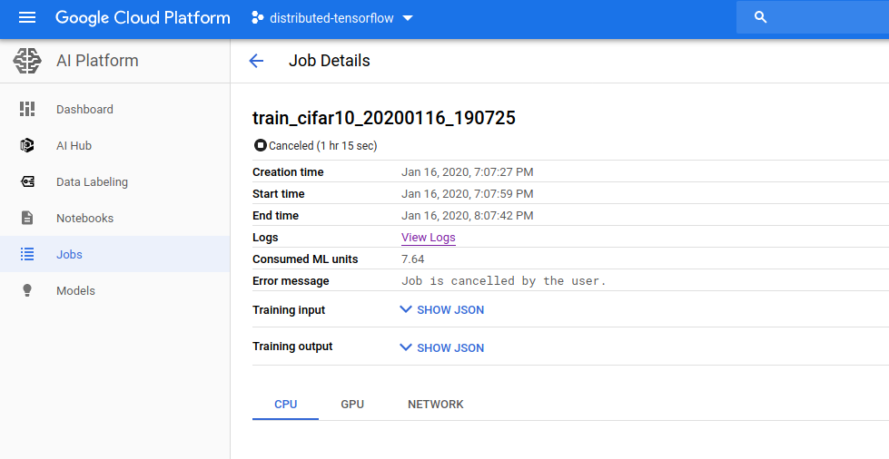
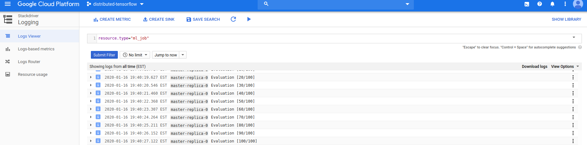

Assignment 3
{: style="color:black; font-size: 210%; font-weight:700; text-align: center;"}
----
# Tensorflow
Due: May 11, 11:59 AM

Tensorflow is a library commonly used for deep learning applications. In this homework, we will focus on the **systems** aspects of Tensorflow. We will discuss checkpointing, distributed training, and training on different hardware.

# Learning Outcomes

After completing this programming assignment, students should be able to:

    Understand the systems aspects of machine learning
    Understand what a master node, parameters servers, and worker servers are and their differences
    Understand checkpointing
    Get some experience with distributed deep learning

## Local Training
### Setup
Before we do any local training, we have to do setup for the local training. To do this, on the bottom left of the Google Cloud Platform, click `Launch a VM`. Next, click `Create`. Go to the `Machine Type` and select any machine that has approximately 16GB of memory. Go to the bottom of the page and click `Create`. \\

We next have to do setup related to setting up the Python environment.
```
sudo apt-get update
sudo apt-get install python3-dev python3-pip
sudo apt-get install python3-venv
sudo apt-get install git
python3 -m venv env
source env/bin/activate
python -m pip install -U pip
python -m pip install -U setuptools
pip install tensorflow==1.15.0
```

Clone the repo that we are going to use to train by using
```
git clone https://github.com/CS-W4121/HW3.git
```

Enter the following command into the terminal
```
python generate_cifar10_tfrecords.py --data-dir=${PWD}/cifar-10-data
```
This code downloads the CIFAR-10 dataset (described at https://www.cs.toronto.edu/~kriz/cifar.html), a commonly used image classification dataset, which is then split into training, validation and evaluation datasets.

1) We begin by training a simple model locally. There are two things that we want to keep track for this training process: the completion time of the training task and the average examples per second during training. Also keep track of the final accuracy and the loss of the model.

We do this by running the following script:
```
python cifar10_main.py --data-dir=${PWD}/cifar-10-data \
                       --job-dir=/tmp/cifar10 \
                       --num-gpus=0 \
                       --train-steps=1000
```
The script decides the number of GPUs used in the training process and the number of training steps for the job.

One way of determining timing is to use the Unix utility time. Put time before the command. For example,
python cifar10_main.py …

An example output given by time is:
```
real    0m10.294s
user    1m37.850s
sys     0m4.705s
```
**Deliverables:**
- Completion time of the training task.
- Average examples per second during training
- Final accuracy of evaluation.
- Loss of the model.


2) We are going to continue to run more training runs. Note that we should have saved a checkpoint. So our job will be continued from this checkpoint. The step number should start from 1000 onwards. The following command will run until the number of global steps is 2000.
```
python cifar10_main.py --data-dir=${PWD}/cifar-10-data \
                       --job-dir=/tmp/cifar10 \
                       --num-gpus=0 \
                       --train-steps=2000
```
Once again, time this training run and also note any evaluation accuracies that occur.  

**Deliverables:**
- Completion time of the training task.
- Average examples per second during training
- Final accuracy of evaluation.
- Loss of the model.

3) Consider changing the --job-dir parameter, since otherwise, it would use the last model. Add more checkpoints. This can be done by adding another parameter to the function.
```
python cifar10_main.py --data-dir=${PWD}/cifar-10-data \
                       --job-dir=/tmp/cifar10 \
                       --num-gpus=0 \
                       --train-steps=1000
            --checkpoint-num-steps=500
```
The default for checkpoint number of steps is 1000. Once again, calculate the time taken to run this value. What is the relationship between the frequency of checkpoints and the time taken for the training run?

**Deliverables:**
- Completion time of the training task.
- Average examples per second during training
- Final accuracy of evaluation.
- Loss of the model.

# Distributed Training
We are going to use AI-Platform for the second part of this assignment.

## Setup
We first begin by running `gcloud init` in the terminal. Choose the option that states `Log In with a New Account`. Type `Y` again and then copy the link into a browser, where your Google Cloud account is already logged in. Follow the instructions, which will include copying back a verification message into the browser.

You will also need to create a storage bucket. This will be where checkpoints and models are saved. We can do this from the console. Change the line in train-cloud.sh, MY_BUCKET= to the address of your bucket. The line should read something like
`MY_BUCKET=“gs://my-bucket/“`

First time that you run a training script, you would also have to uncomment the following line
`#gsutil cp -r ${PWD}/cifar10_estimator/cifar-10-data $MY_BUCKET/` to copy over the training files to the cloud storage folder.

## How to Obtain Logs
You get logs by going to the AI-Platform console on Google Cloud. Click Jobs on the left panel and click the job that you are interested in.   Then click view logs. Click Download Logs.   Note that it will only download the last 300 log entries (those that are loaded.) Make sure that you capture the final 300 lines. 

5) After setup is done, run the following script. Save this in `train-cloud.sh`.

```
set -euxo pipefail

echo "submitting a AI Platform job.."

MODEL_NAME="cifar10"

CURRENT_DATE=`date +%Y%m%d_%H%M%S`
JOB_NAME=train_${MODEL_NAME}_${CURRENT_DATE}

MY_BUCKET="gs://4121-data/"
#gsutil cp -r ${PWD}/cifar10_estimator/cifar-10-data $MY_BUCKET/

gcloud ai-platform jobs submit training $JOB_NAME \
    --runtime-version 1.15 \
    --job-dir=$MY_BUCKET/model_dirs/cifar_${CURRENT_DATE} \
    --config cifar10_estimator/cmle_config.yaml \
    --package-path cifar10_estimator/ \
    --module-name cifar10_estimator.cifar10_main \
    -- \
    --data-dir=$MY_BUCKET/cifar-10-data \
    --num-gpus=0 \
    --train-steps=10000

(sleep 1h; gcloud ai-platform jobs cancel $JOB_NAME ) &
```
We briefly describe what is happening here. `set -euxo pipefail` ensures that if a command in the script fails, then the whole script fails. The lines that include `CURRENT_DATE`, `JOB_NAME`, `MY_BUCKET` involve setting the variables. In particular, `MY_BUCKET` has to be set to a Google storage bucket. THe next line is what submits the job to AI-Platform for training. Note that we are still allowed to change the settings below the empty `--`, which allows us to pass in the arguments for the `cifar10_main` program here. To replicate a job, the module-name has to include a `Trainer` package, such that the program then know what to do during the training process.

**Deliverables:**
- Logs of the training task.

6) Next, look at `cifar10_estimator/cmle_config.yaml`. It should be something like:
```
trainingInput:
    scaleTier: CUSTOM
    masterType: n1-standard-16
    workerType: n1-standard-16
    parameterServerType: n1-standard-16
    workerCount: 1
```
This is the settings used to run our job. The job has a master server, worker servers and a parameter server. The master server is in charge of all the communication. In our setting, where what we are doing is synchronous training, the master server is in charge of sending the jobs to the workers. Note, for example, what happens with the step numbers across the different workers. To familiarize yourself with the available machine types, look [here](https://cloud.google.com/ml-engine/docs/machine-types). 

For this question, we want to run this with 2 parameter servers and 4 workers.

**Deliverables:**
- Logs of the training task.
- Your `cmle_config.yaml` file.

7) Finally, run once more, this time with GPU. To do this, you will have to change the machine type to `complex_model_gpu`.
For this, we also want to change the --num_gpus parameters to be 4 in the `train-cloud.sh` file.

**Deliverables:**
- Logs of the training task.
- Your `cmle_config.yaml` file.


# Altering the Neural Network

8) Thus far, we have treated the neural network as a black box. We are now going to alter the neural network that we are going to use to train. We are going to do so in three ways:
    1. Fill out the function `fully_connected_with_activation` in `cifar10_model.py` such that it is now a Dense layer with `tanh` activation, and then replace the final layer on line 78 in `cifar10_model.py` with `fully_connected_with_activation`.
    2. Replace the optimizer of the model with the `Adagrad` optimizer.
    3. Replace the loss function with `sigmoid_cross_entropy`.

**Deliverables:**
- Submit your updated files for `model_base.py` and `cifar10_model.py`. This file should reflect the changes in the changed optimizer and loss function.

# Submission Instructions

File name

Each group should submit one tar.gz file to Canvas.

Name the file as `<group_num>_assignment2.tar.gz`. For example, `g1_asaf_assignment2.tar.gz`.

In the folder, should be the required graphs and all the written solutions to the problem.

**Acknowledgments:**

This assignment is based on Peifeng Yu and Mosharaf Chowdhury's UMICH EECS598: Advanced Topics on Systems for X.
